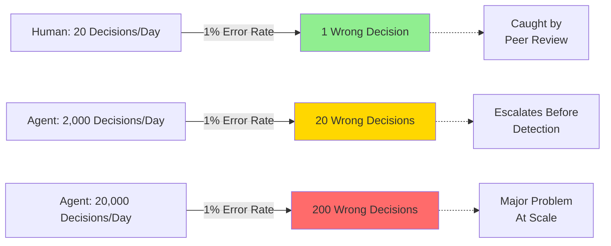
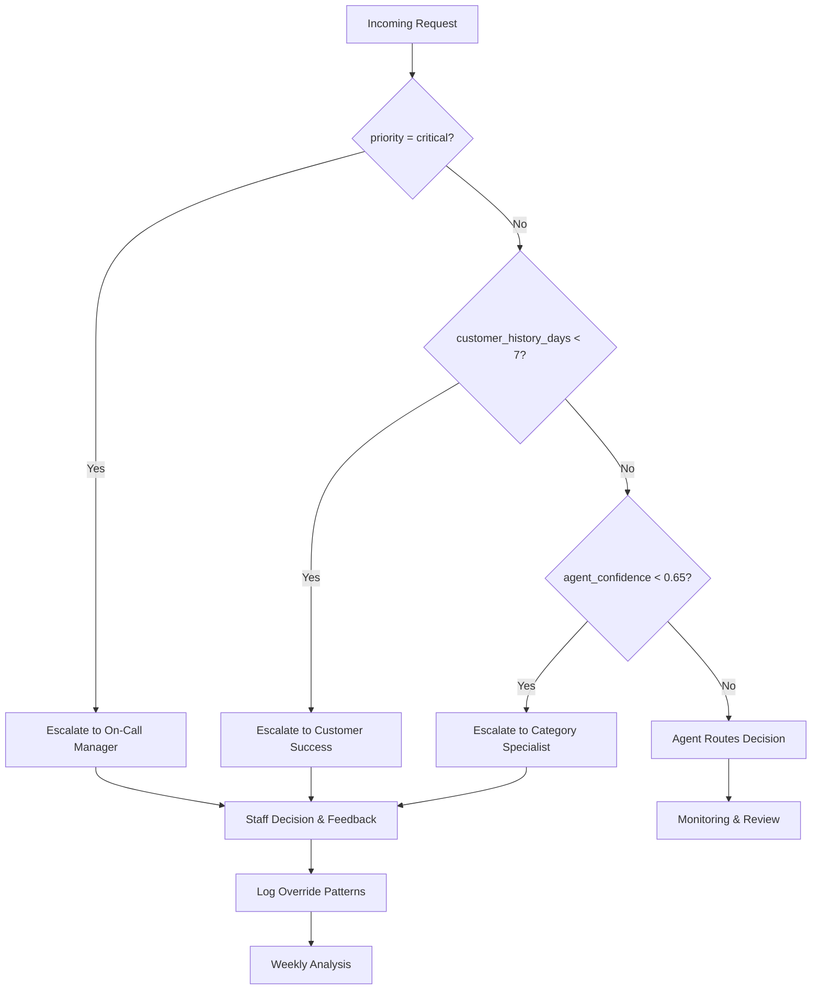
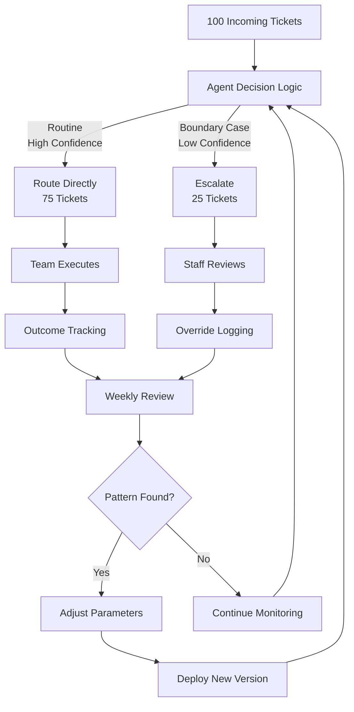
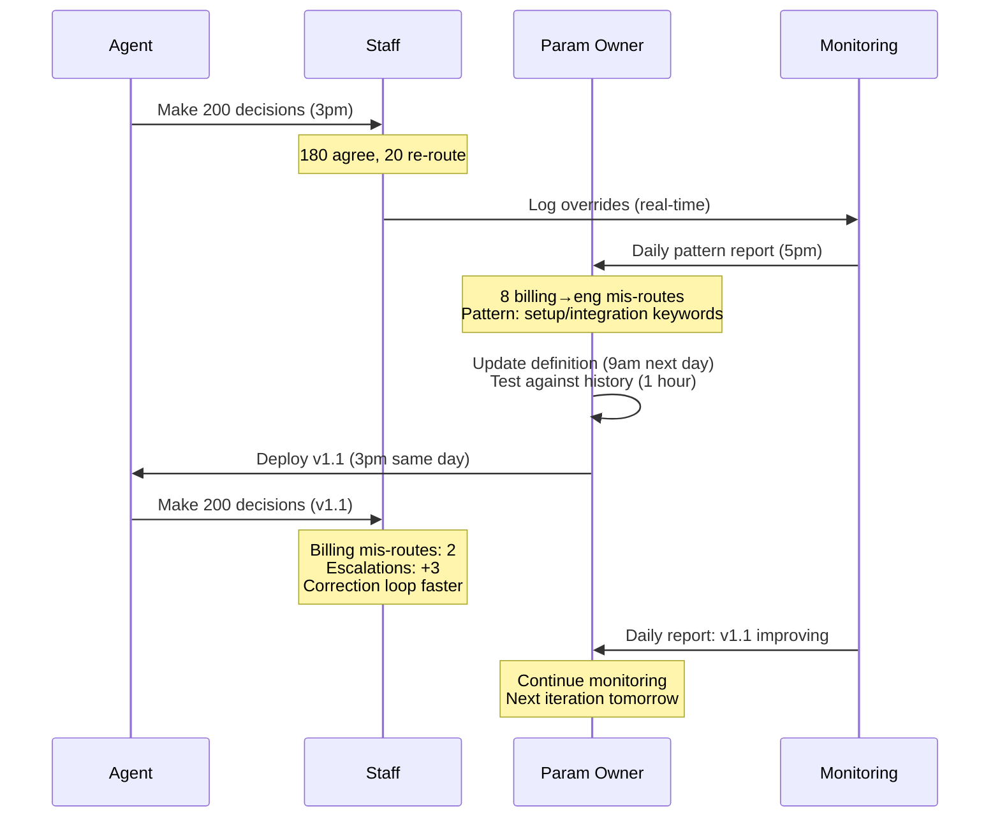
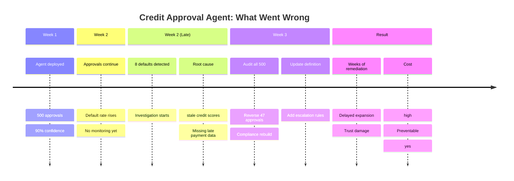

Agents execute decisions at scale. Unlike humans, they don't adapt, flag uncertainty, or balance competing priorities. They execute definitions exactly as written, repeatedly, across thousands of decisions.

This requires a different operating model.

## How Agents Differ From Humans

**Humans make contextual errors. Agents make systematic errors.**

A human underwriter occasionally misjudges risk based on individual circumstances. An agent, given the same parameters and data, makes the same decision every time. If the parameters are wrong, the error replicates across every similar situation.

**Humans adapt. Agents follow definitions.**

When conditions change, humans adjust. Agents continue applying the same logic until parameters are explicitly updated.

**Humans flag uncertainty. Agents proceed.**

A human escalates when unsure. An agent has no concept of "I'm not sure"—unless explicitly built in. Operating on incomplete data, it proceeds confidently.

**Humans balance tradeoffs. Agents optimize what you measured.**

A human considers unstated factors like relationship value or strategic importance. An agent optimizes exactly what you told it to optimize for, nothing more.

These aren't flaws—they're structural features that make agents deterministic and scalable. But they require rigorous operating models: clear definitions, quality data, explicit escalation rules, version control, and continuous monitoring.

## What Agents Need to Perform Well

Structure agents as harnesses: constrained systems that handle routine decisions and escalate to staff at boundaries.

**Agent Definition**

Write explicit, testable rules. Not "route tickets to the right team" but "if category=billing, route to finance@company.com; if category=technical AND priority=high, route to eng-urgent@company.com."

An engineer unfamiliar with your domain should predict behavior on any input.

**Agent Goals**

Define measurable success before deployment:
- Primary metric: What matters most? (e.g., accuracy, speed, customer satisfaction)
- Baseline: What's the comparison? (e.g., current manual process has 15% error rate)
- Thresholds: When does performance need investigation? (e.g., "if accuracy drops below 85%")

**Agent Skills**

Specify what the agent can do:
- Data access: Read-only to customer data? Write to ticket status?
- Actions: Can it send notifications? Assign work? Create records?
- Escalation triggers: When does it hand off? (e.g., "priority=critical always escalates," "confidence < 70% escalates")

Make escalation explicit. "This agent handles routine requests but escalates anything security-related, customer-critical, or low-confidence."

**Agent Tools**

Define system access precisely:
- Read access: Which tables? Which fields?
- Write access: What can it create or modify?
- Forbidden access: What's absolutely off-limits?

Enforce these via permissions. Log all access attempts.

**Agent Memory and Learning**

Define how feedback becomes parameter changes:
- Feedback sources: Real-time staff overrides? Daily pattern analysis? Escalation alerts?
- Adjustment trigger: "If 5+ tickets in category X are re-routed by staff in a single day, investigate and adjust parameters same day"
- Authority: Who approves changes? (Parameter owner? Domain expert? Compliance?)
- Feedback cycle: Staff override → logged (real-time) → daily pattern analysis → parameter adjustment (same day) → testing (hours) → deployed (same day) → monitored

**Agent Evaluations**

Set up continuous monitoring:
- Real-time alerts: Automation flags when metrics deviate. (e.g., "accuracy dropped to 78%", "escalation rate jumped 20%")
- Daily review: Pull sample of 50 decisions made yesterday. Verify they match the definition. Check outcomes.
- Response: Owner investigates within hours for critical issues, same day for patterns. Decision: adjust, halt, or continue.

Make this mechanical, not discretionary.

**Agent Version Control**

Track definitions systematically:
- Repository: Where are agent parameters stored? (Git with YAML files)
- Change tracking: Every change committed with rationale and approval
- Deployment mapping: Agent v2.3 deployed 2026-08-01 with X parameters. Agent v2.4 deployed 2026-08-08 with Y changes.
- Rollback: Quick revert if performance degrades

**Agent Escalation**

This is the most important constraint. Define clearly:
- Explicit triggers: What situations does the agent never handle? (e.g., "priority=critical," "new customer," "confidence < 60%")
- Escalation path: Where does it go? (e.g., "Critical → on-call manager. New customer → customer success.")
- Context: What information does the agent provide? (Reasoning, confidence, alternative routes considered)
- Feedback: When staff overrides the agent, log it and review daily for patterns.

Example escalation logic:

## The Harness Model

Agents are harnesses, not replacements. The agent handles routine decisions. Staff handles escalations and provides feedback that improves the agent.

Example: Agent routes 100 tickets, confidently handling 75 and escalating 25. Staff reviews escalations and finds that "integration" tickets are escalated 60% of the time but routed correctly by staff 95% of the time. Pattern identified: the agent's keyword detection misses common setup terminology.

Next day: Definition updated with better keywords, tested against yesterday's decisions, deployed. Integration escalation drops to 25%. Staff now handles only genuinely ambiguous cases, not near-misses.

This loop repeats daily. Each iteration reflects actual staff feedback into tighter parameters.

## Agent Controls and Constraints

Agents operating without constraints are dangerous. Every agent needs guardrails built into its operation.

**Access Control**: Agents access only what they need. A support routing agent reads ticket data and routes to channels—it doesn't read customer payment history or internal notes. Permissions are enforced at the system level, not trusted to the agent's design. If the agent requests forbidden data, the attempt is logged and escalated.

**Rate Limiting**: Agents have decision caps. A loan approval agent might be limited to 500 approvals per day. A content moderation agent might be limited to 1,000 decisions per hour. When the agent approaches the limit, alerts fire. When it hits the limit, it stops and requires human intervention.

**Confidence Thresholds**: Agents don't make decisions below their confidence floor. An agent given a request it's 30% confident about doesn't make a guess—it escalates. Confidence threshold is explicit and monitored. If an agent frequently operates at low confidence, that signals the definition needs refinement or the data quality needs improvement.

**Data Freshness Constraints**: Agents operate only on data within acceptable age. A credit approval agent requires credit scores no older than 14 days. A pricing agent requires inventory data no older than 1 hour. If required data is stale, the agent escalates rather than proceeding with outdated information.

**Decision Size Limits**: Large decisions require more scrutiny. An agent might approve invoices up to $10,000 without escalation but escalate anything above that. A content agent might remove low-value spam but escalate potential misinformation. These limits prevent single agent decisions from creating catastrophic damage.

**Parameter Change Approval Gates**: Agents can't update their own definitions. Parameter changes require approval from a parameter owner and potentially additional stakeholders (compliance, legal, domain expert). Changes are tested before deployment. Rollback to previous version is always available.

**Monitoring and Alerting**: Agents are continuously watched. Alerts fire on anomalies: decision rate spikes, accuracy drops, escalation rate changes, outcome distribution shifts. These aren't optional—they're part of the control architecture.

**Audit Logging**: Every decision is logged with full context: parameters applied, data accessed, reasoning, confidence, outcome. Logs are immutable and queryable. No decision exists without a trace.

**Reversibility Requirement**: Agents can only make reversible decisions. An agent that sends an email notification can't unsend it—so escalate decisions that trigger irreversible actions. An agent that approves a loan (reversible—can be overturned) operates with more freedom than an agent that permanently deletes records.

Controls aren't restrictions that slow agents down. They're the infrastructure that makes agents trustworthy and controllable. Without them, you have autonomous systems making decisions beyond your ability to understand, audit, or correct.

## Auditability and Reversibility

Agents execute changes to your systems. A credit agent approves loans. A support agent routes tickets. These actions have consequences.

You need three capabilities:

**See what changed**: Before/after state snapshots for every agent action. What data was available? What parameters were applied? What decision was made?

**Understand why**: Complete audit trail with reasoning, confidence score, parameters used, data source.

**Reverse it**: If the agent makes a mistake, undo it. Not just "delete the record" but rollback cascading effects (loan approved → transfer queued → customer notified).

Build this into your system architecture:
- Immutable audit log (append-only, never overwritten)
- State versioning (snapshot before and after each action)
- Reversal queue (review before executing, document approval and rationale)

Example query capability:
- "Show all decisions agent v2.1 made for customer X"
- "Show all approvals where confidence was below 0.75"
- "What state was this application in on 2026-08-01?"

When an agent's definition changes (update parameters), previous decisions were made under old rules. Version-tie decisions so you can ask: "Which approvals were made under v2.1 vs v2.2?" This matters when policies change and you need to identify affected decisions for compliance or reversal.

**Reversibility creates confidence**. Knowing mistakes can be undone means agents can operate with more autonomy. Without reversibility, you need perfect accuracy before deployment—expensive and time-consuming.

## The Feedback Cycle in Practice

Here's what a complete feedback loop looks like:

**Day 1, 3pm**: Agent v1.0 deployed. Routes 200 tickets today. Staff agrees with 180 (90% agreement). 20 are re-routed by staff.

**Day 1, 5pm**: Daily pattern analysis: Of the 20 re-routes, 8 have category=billing but were routed to engineering. Staff notes: "These are billing questions with technical setup involved."

**Day 2, 9am**: Parameter owner investigates. Query: "Show me all category=billing tickets re-routed to engineering in the past 24 hours." Result: 8 instances. Pattern confirmed. Decision: adjust parameters.

**Day 2, 11am**: Owner updates agent definition. Add keywords: "if category=billing AND (keyword:setup OR keyword:integration OR keyword:installation) then escalate to category_specialist instead of routing to finance."

**Day 2, 1pm**: Testing: Run against last 24 hours of historical tickets to verify the new logic catches the 8 problem cases.

**Day 2, 3pm**: Deployment: Agent v1.1 deployed with refined keyword detection. Monitoring activated.

**Day 3, 9am**: Results review: Billing escalations increase slightly (expected—catching ambiguous cases), but billing-to-engineering mis-routes drop to 2 in first 24 hours. Net result: fewer staff corrections, faster resolution.

This cycle happens continuously—daily analysis, hourly adjustments for critical issues. Each iteration tightens the agent based on real-time feedback.

## What Goes Wrong: A Common Mistake

Organizations often deploy agents without clear escalation boundaries or feedback loops. Example:

An organization builds a credit approval agent. Definition: "Approve if credit_score > 680 AND debt_to_income < 0.45." No escalation thresholds. No confidence scoring. No staff review feedback built in.

Agent goes live. Approves 500 applications in week one.

Two weeks later: Default rate spikes. 8 of the 500 approvals are in default already. Investigation reveals: the agent was using stale credit scores (updated monthly, but 3 weeks old by approval time) and missing recent late payments flagged in a different system.

Problem: No escalation rule like "escalate if credit score is older than 2 weeks." No feedback loop to catch this. Staff had no chance to catch it before scale.

The fix took weeks: audit all 500 approvals, reverse 47 that violated policy, update the agent definition, rebuild trust with compliance team. Cost: significant, both in direct reversal work and delayed agent expansion.

What would have prevented this: Explicit escalation rules ("escalate if data freshness > 2 weeks"), version-tied decisions (so you know exactly which decisions used which definition), and staff review feedback.

## How to Start

1. **Pick your first agent domain carefully**: Choose something with clear, objective criteria (e.g., ticket routing), reversible actions (easily undone), and high volume (so patterns emerge quickly). Avoid subjective judgments, permanent consequences, or low-volume decisions initially.

2. **Write the definition as executable rules**: Not "approve creditworthy applicants." Write: "Approve if score > 680 AND DTI < 0.45 AND employment_years > 2. Escalate if score is stale (> 14 days). Escalate if employment verification failed."

3. **Define escalation thresholds explicitly**: When does the agent hand off? Low confidence? Missing data? Unusual combinations? List every escalation condition. Don't say "escalate when needed"—that's not mechanical.

4. **Set up staff feedback capture**: Decide how staff overrides will be logged and reviewed. Daily summary: "Show me all decisions where staff disagreed with the agent." Make this query automatic and alert on patterns within 24 hours.

5. **Deploy with monitoring, not just metrics**: Don't just track accuracy. Track escalation patterns. If escalation rate suddenly jumps, alert someone. If staff agreement rate drops, investigate why.

6. **Plan the feedback-to-adjustment cycle**: When you spot a pattern (staff re-routes all "integration" tickets), who investigates? Who proposes a parameter change? Who tests it? Who approves deployment? Make this process clear before your first feedback arrives.

## Best Practices for Continuously Monitored Agents

**Real-time monitoring dashboards**: Show agent decision rate, accuracy, escalation rate, and outcome distribution. Not a luxury—foundational. When any metric deviates from baseline, alert automatically.

**Decision-level logging**: Every decision captured with timestamp, parameters applied, data used, reasoning, confidence score, and outcome. Query capability: "Show me all decisions for customer X" or "Show me all low-confidence approvals from yesterday." This isn't audit theater—it's how you investigate problems.

**Daily pattern analysis**: Automated daily summaries of staff overrides. "Staff re-routed 12 billing tickets to engineering yesterday. Pattern: technical setup questions mis-categorized." Escalate patterns (5+ same type) to parameter owner for same-day investigation.

**Confidence scoring on every decision**: Agents should provide not just a decision but a confidence level. Low-confidence decisions (below your threshold) escalate automatically. Monitor confidence distribution—if confidence stays artificially high, the agent may be overconfident in novel situations.

**Outcome tracking**: Link agent decisions to real-world results. Did the approved loan default? Was the routed ticket resolved in SLA? Did the recommended action improve customer satisfaction? Agents trained on historical data can degrade when real-world conditions change. Outcome tracking detects this drift.

**Data quality monitoring**: Parallel to agent monitoring. Track completeness, freshness, and accuracy of data the agent depends on. If data quality drops, agent performance will follow—but you'll know why. Alert when required fields are missing in >1% of records or when data age exceeds threshold.

**Parameter change process**: Every change documented, tested, approved, and deployed with monitoring. No ad-hoc updates. Version control ties each deployed agent version to specific parameters and results. Rollback available if performance degrades.

**Incident response playbook**: When something goes wrong (accuracy drops 10 points, escalation rate spikes 30%), what's the process? Who's notified? How quickly must someone investigate? Can the agent be paused? How do you identify affected decisions? Write this down before the first incident, not during.

**Weekly governance review**: Parameter owners, data owners, and monitoring leads meet to review: Did any alerts fire? Were patterns identified and acted on? Is the agent performing within goals? What's next? This prevents drift from accumulating silently.

**Escalation path clarity**: Every escalation decision includes context: agent's reasoning, alternative routes considered, confidence score, relevant data. Staff never receives an escalated case blind. They understand why the agent couldn't handle it.

**Staff feedback loop automation**: When staff overrides an agent, capture it in structured form: what did staff do differently? Why? This feeds directly into daily analysis. If the same override pattern appears 5 times, system suggests parameter adjustment to the owner.

**Staged deployments**: New versions deploy to 5% of traffic first, monitored for 24 hours. If performance matches baseline, increase to 25%. This catches definition errors on a small scale before scale.

**Data quality validation gates**: Before parameter changes deploy, validate the data the agent will operate on meets quality standards. If freshness or completeness drop below threshold, halt deployment until data is fixed.

Best practices share a theme: **automation with human authority**. Systems detect patterns and flag anomalies automatically. Humans make decisions about what to do. Speed comes from having alerts, dashboards, and queries ready before you need them—not from cutting out human oversight.

## Key Points

**Agents are different.** They make systematic errors at scale, not contextual ones. A 1% error rate on 20,000 decisions daily is 200 wrong decisions.

**Structure matters.** Agents need explicit definitions (not ambiguous guidance), clear escalation rules (not subjective judgment), version control (not ad-hoc updates), and continuous monitoring (not launch-and-forget).

**Agents are harnesses, not replacements.** They handle routine, high-confidence decisions. Staff handles escalations, provides feedback, and adjusts parameters based on patterns.

**Feedback loops are critical.** Staff overrides → patterns identified → parameters adjusted → tested → deployed. This cycle happens continuously, tightening the agent over time.

**Reversibility creates confidence.** Build audit trails and rollback capability. Knowing mistakes can be undone means agents can operate with more scope.

**Operating models enable or constrain.** The difference between success and failure isn't technical—it's organizational. A disciplined operating model treats agent governance as foundational: explicit definitions, data quality validation, staff feedback capture, and rapid parameter adjustment.

Deploy agents correctly, and they become self-improving systems. Skip the operating model work, and you'll deploy successfully, discover problems at scale, and spend months remediating.
