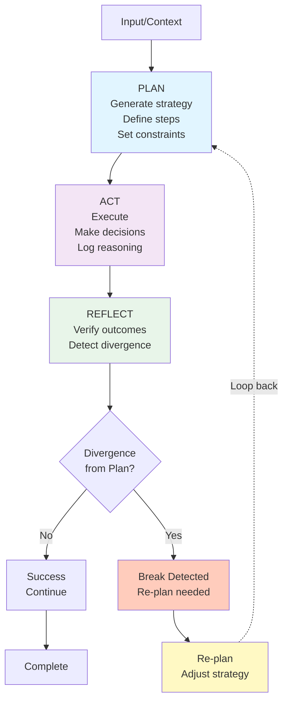

A year ago, most agent implementations followed a simple loop: perceive → decide → act → repeat. Anthropic's research has crystallized what actually works: agents that plan before acting, delegate appropriately, and verify outcomes outperform pure reactive systems. Understanding these patterns is critical to building agents that work reliably.

## Agents vs. Workflows: Know When to Use Each

The first pattern evolution is recognizing that not every problem needs an agent. Anthropic distinguishes between:

**Workflows**: Deterministic sequences. You know the steps, the order, and the decision points. Example: "validate input → fetch data → format output." Use workflows when the path is predictable.

**Agents**: Appropriate for complex, multi-step problems where the path isn't predetermined. The agent needs to reason about approach, make decisions, and adapt.

The evolution over 12 months: organizations stopped defaulting to agents. They ask: "Does this actually need planning and adaptation, or is it a workflow?" This distinction prevents overcomplicating simple problems.

## Planning and Reflection: The Core Pattern

Anthropic identifies this as the most significant pattern for complex problems.

**Simple Loop** (reactive):
- Observe state → decide → execute → repeat

**Planning-Based** (deliberative):
- Think through the problem → create a plan → execute the plan → reflect on results

Planning adds a reasoning phase where the agent thinks: "What's my goal? What steps will achieve it? What could go wrong?" This makes intent explicit and guides execution.

Reflection adds accountability. After acting, the agent checks: "Did this work as expected? Did conditions change? Do I need to adjust?"

**Value of planning and reflection:**
- Explicit intent resists local optimization
- Reasoning is auditable
- Failure detection is systematic
- Adjustment is deliberate

## Tool Use: Agents Interacting with Systems

A year ago, tool use was limited. Agents had access to a few fixed tools. Today, tool integration is sophisticated:

**Tool definition**: Agents understand what tools exist, what they do, and how to use them. Tool schemas are explicit and queryable.

**Tool chains**: Agents sequence multiple tools. The output of one tool becomes input to the next, with the agent maintaining context and state across calls.

**Error handling**: When a tool fails, the agent doesn't crash. It logs the error, analyzes what went wrong, and adjusts (retry, escalate, use alternative tool).

**Capability vs. Permission**: The agent knows what it's capable of but also knows what it's allowed to do. These are often different—and that boundary matters for safety.

## Routing and Delegation: Multi-Agent Architectures

Anthropic's research emphasizes that multi-agent systems work best when agents are specialized.

**Routing agents**: Receive a request, analyze it, and route to the right specialized agent. Router doesn't do the work—it determines who should.

**Specialized agents**: Each has a narrow scope and deep capability in that area. Takes clear input, produces clear output, reports confidence.

**Aggregation**: Results from specialized agents are collected, compared, and synthesized by the router or parent agent.

Evolution in 12 months:
- Specialized agents now share context richly, not just exchange inputs/outputs
- Hierarchies can be deeper (agent → sub-agent → sub-sub-agent)
- Confidence scoring is standard (each agent reports how sure it is)
- Failure modes are explicit (parent agent knows what to do if a specialist returns conflict)

## Loop Safety: Bounded Iteration

The basic agentic loop was fragile. Agents could loop infinitely, drift from intent, or fail silently. Loop safety addresses this:

**Bounded iteration**: Set a max depth. After N attempts without progress, escalate rather than continue.

**Intent preservation**: Every iteration includes a check: "Am I still working toward the original goal?" If unclear, escalate.

**State tracking**: Agent maintains not just current state but state deltas. "What changed this iteration?" makes drift visible.

**Outcome verification**: Agent verifies actions succeeded before proceeding. Doesn't assume—confirms.

These aren't restrictions that slow agents. They're infrastructure that makes agents controllable and debuggable.

## Emerging Patterns

**Specification-driven agents**: Given formal specifications of what correct output looks like, agents can verify their own work against specs.

**Multi-model routing**: Different models for different tasks. Agents route work to appropriate model (fast model for classification, powerful model for reasoning).

**Agent versioning and canaries**: Treat agent versions like software versions. Test on 5% of traffic before full rollout.

**Feedback-driven adjustment**: Agent parameters auto-adjust based on outcome feedback. If accuracy drops for certain inputs, parameters adjust specifically for that type.

**Behavioral contracts**: Agents commit to constraints at runtime. "I will escalate if confidence <70%." Contracts are enforced.

## What Anthropic's Research Emphasizes

The core insight from Anthropic's work: **agents work best when constrained**.

The intuition is backwards from how people think about autonomy. More autonomous agents that ignore constraints perform worse than constrained agents that stay within defined boundaries.

Constraints enable:
- **Auditability**: You can trace reasoning and understand decisions
- **Controllability**: You can redirect or halt agent behavior
- **Predictability**: The agent won't surprise you with unexpected behaviors
- **Reliability**: The agent is harder to break because it knows its limits

The agents that work aren't the most autonomous—they're the most disciplined.

## References

- [Anthropic: Building Effective Agents](https://www.anthropic.com/engineering/building-effective-agents) — Framework for designing agents with planning, tool use, and delegation
- [Reasoning about Reasoning: What LLM-based Agents Can Do](https://arxiv.org/abs/2410.15231) — Analysis of agent reasoning patterns and limitations
- [Agent Workflows for Large-scale Systems](https://arxiv.org/abs/2404.17592) — Patterns for scaling hierarchical agent systems
- [Autonomous Agents Modelling Chains, Trees, and Graphs](https://arxiv.org/abs/2410.05601) — Comparison of agent architecture patterns
- [The Cost of Unreliable AI Systems](https://arxiv.org/abs/2309.12288) — Why safety and verification matter for agent deployment
